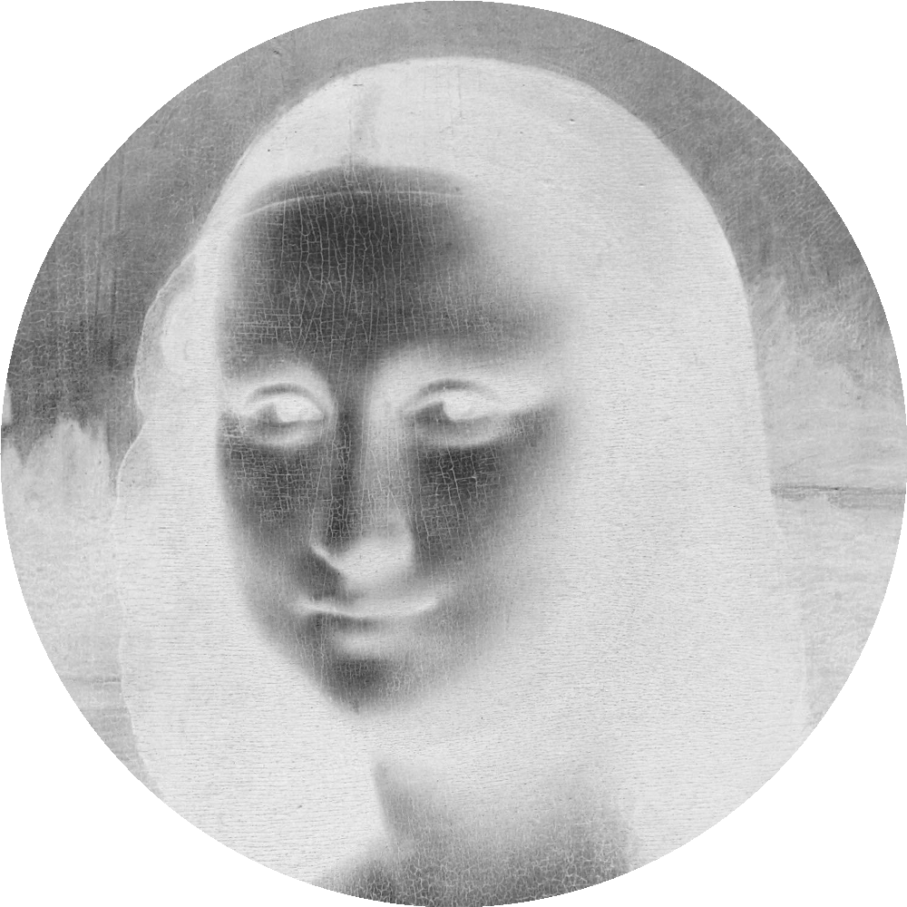
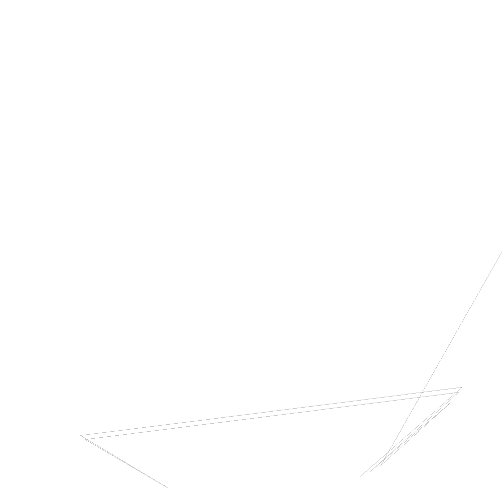

# String-Art-Processing
Make String Art for any reference image

Essentially,

<li>Find the darkest line between any two of the 263 points around the edge of the circle.</li>
<li>Add that line to the output image.</li>
<li>subtract that line from the input image.</li>
<li>Repeat 5400 times.</li>
<li>Final sequence of strings is printed to the output window at the bottom of the processing app.</li>
 
Read the comments at the top of the code to find tweakable values like total number of points, number of lines, and so on.
 
 
<h1> Setup phase </h1>
<li>Invert input image<l1>
<li>Determine coordinates of pins<l1>
<li>Create circular mask<l1>  

  
<h1> Draw phase </h1>
<li>Subtract (lighten) a line from input image<l1>
    
<li>Add a line (darken) output image <l1>
    
<li>Save final image once done<l1>  

